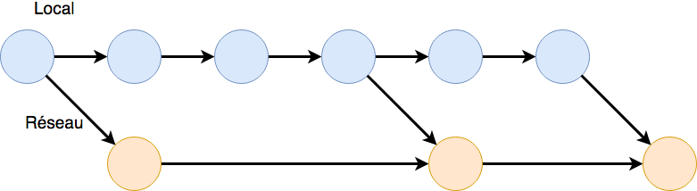

# (PART) SDD I: visualisation {-}

# Introduction {#intro}

##### Objectifs {-}

- Se familiariser avec les outils de base (SciViews Box, RStudio, Markdown, Git, GitHub).

- Maîtriser la terminologie particulière liée à Git (un système de gestion de versions de vos documents que nous utiliserons intensivement ensuite).

- Réaliser son premier document écrit en Markdown, un système de formattage de teste.


## Le monde il y a 30 ans {#donnees}

Il y a 30 ans, pas d'internet (ou un embryon d'internet disponible uniquement pour quelques privilégiés dans les universités et l'armée américaine), pas de smartphone. Essayez d'imaginer ce que serait votre vie aujourd'hui si ces outils qui font partie de votre quotidien n'existaient pas.

- Les révolutions industrielles:
    * 1770 (1756) révolution 1\ : mécanisation
    * 1870 révolution 2\ : maîtrise de l'énergie
    * 1970 (1979) révolution 3\ : informatique
    * 1990 révolution 4\ : internet (1990 Web, 1992 ISOC = Internet society, 1993 = premier navigateur web)
    * 2000 révolution 5\ : numérique. GAFA = Google - Apple - Facebook - Amazon + Microsoft = GAFAM aux USA et BATX en Chine = Baidu - Alibaba - Tencent - Xiaomi. Aussi NATU = Netflix - Airbnb - Tesla - Uber.
    * 2010 révolution 6\ : NBIC = nanotechnologies - biotechnologies - informatique - sciences cognitives.
    * 2020 = date prévue pour que l'ordinateur ait la même puissance de traitement de l'information que le cerveau humain
    * 2030 = trans-humanisme\ : ordinateur plus puissant que l'homme et le remplacera probablement dans de nombreuses tâches.

- Valeur estimée des données et informations mises à disposition par les utilisateurs du net: 1000 milliards de dollar par an (écrivez ce nombre en chiffres pour vous donner une meilleure idée de ce que cela représente)\ !

- En 2020, quantité d'information ajoutée sur le net\ : 1000 milliards de milliards par semaine (écrivez ce nombre en chiffres également).

- Comparaison de puissance de traitement du cerveau humain _versus_ un ordinateur\ : 89 milliards de neurones et travail en multitâche d'un côté, contre 2 milliards de transistors pour un travail essentiellement monotâche pour le petit carré de silicium. Il faut bien avouer que c'est difficile à comparer (combien de transistors équivalent à un neurone\ ?). Une étude a montré en 2017 que l'un des cinq ordinateurs les plus puissants du moment a été capable de simuler le fonctionnement d'environ 1% du cerveau humain en une seconde. Il lui a fallu 40 minutes de calcul pour y arriver. Intel (l'un des principaux constructeurs de processeurs) estimait il y a à peine quelques années que l'évolution permettra d'égaler le cerveau humain en terme de vitesse de traitement vers 2020... On y est, l'intelligence artificielle est partout autour de nous, mais ne nous remplace pas encore (heureusement\ !)

- Consommation électrique d'un supercalculateur\ : se mesure en mégawatts, alors que le cerveau humain consomme 12-13W seulement\ !

- "Le **transhumanisme** est une approche interdisciplinaire qui nous amène à comprendre et à évaluer les avenues qui nous permettrons de surmonter nos limites biologiques par les progrès technologiques. Les trans-humanistes cherchent à développer les possibilités techniques afin que les gens vivent plus longtemps et ..."

Ce petit rappel historique et ces quelques informations concernant les données vous donne d'une part un aperçu de la vitesse à laquelle notre monde change, et d'autre part ils vous montrent que le monde dans lequel nous vivons est de plus en plus inondé d'information. Vous pouvez maintenant imaginer l'importance d'avoir des outils performants afin d'appréhender les données dont le nombre croit de manière exponentielle. Pour ce cours de sciences des données,  plusieurs outils puissants sont mis à votre disposition (Vous trouverez sur l'hyperlien suivant, un poster présentant la philosophie du cours <https://github.com/BioDataScience-Course/RencontresRRennes2018>)

## Découverte des outils

La science des données est complexe et requiert d'employer des outils performants que nous avons sélectionnés parce que nous faisons le pari que ce seront les outils qui vous seront les plus utiles... dans les 30 prochaines années, c'est-à-dire pendant une bonne partie de votre carrière (mais nous sommes conscients que c'est un pari risqué\ !).


### Machine virtuelle

La **SciViews Box** est une machine virtuelle (un ordinateur complet, mais totalement indépendant du matériel -le hardware- et qui peut être déployé sur pratiquement n'importe quel ordinateur physique). Cette SciViews Box est complètement configurée et dédiée à la sciences des données biologiques. Elle contient tout ce qu’il faut pour importer et analyser vos données, et ensuite écrire des rapports ou d'autres documents prêts à publication ou à présentation. Elle vous servira également à collaborer avec d'autres chercheurs qui peuvent facilement utiliser exactement la même machine virtuelle (aspect reproductible de vos analyses).

```{r echo=FALSE, out.width="256px", fig.cap="Logo de la SciViews Box"}
knitr::include_graphics('images/sdd1_01/svBox-256.png')
```

Des explications détaillées se trouvent dans l'annexe \@ref(svbox) dédiée à l'installation, la configuration et l'utilisation de la SciViews Box.

`r h5p(18, height = 270)`

### RStudio

RStudio est l'outil au sein de la SciViews Box que vous allez utiliser le plus fréquemment durant ce cours.


Il fournit un environnement complet et optimisé pour réaliser vos analyses, vos graphiques et vos rapports. RStudio travaille main dans la main avec le logiciel R qui effectue l'ensemble des traitements.

`r h5p(16, height = 270)`

Des explications détaillées se trouvent dans l'annexe \@ref(rs) qui présente les bases de l'utilisation de RStudio. Vous avez également à votre disposition un aide-mémoire afin d'appréhender cette interface [RStudio IDE Cheat Sheet](https://github.com/rstudio/cheatsheets/raw/master/rstudio-ide.pdf). 


##### Pour en savoir plus {-}

- [RStudio](https://www.rstudio.com/). Site Web de RStudio comprenant un ensemble de ressources en anglais

- [RStudio, un environnement de développement pour R](https://quanti.hypotheses.org/488/). Brève explication de RStudio en français.

- [RStudio : sa vie, son oeuvre, ses ressources](https://elementr.hypotheses.org/237). Un autre site Web consacré à RStudio en français.


### Markdown

Dans RStudio, les rapports sont rédigés en utilisant le langage **Markdown** dans la zone d'édition. Il permet de baliser le texte pour indiquer le sens des différentes parties (par exemple, pour indiquer les différents niveaux de titres) et de se concentrer sur l'écriture dans un premier temps en dissociant le fond de la mise en forme. En effet, vous vous préoccupez de l'aspect final du document dans un second temps, et même, vous pouvez changer radicalement d'avis pratiquement sans rien changer dans le texte (par exemple, il est possible de passer d'une page Web à un document PDF ou Word, ou même encore à une présentation).


**Markdown** est relativement simple et intuitif à l'usage, même si un petit effort est nécessaire, naturellement, au début. Quels sont les commandes et instructions indispensables lorsque l'on rédige un rapport ?  Des titres et sous-titres, une mise en évidence (texte en italique ou en gras), des listes,... Il ne faut au final que très peu de commandes pour réaliser un rapport de qualité avec une mise en page sobre et épurée qui caractérise les travaux professionnels. 

Vous avez à votre disposition deux aide-mémoires pour apprendre **Markdown** : [R Markdown Cheat Sheet](https://github.com/rstudio/cheatsheets/raw/master/rmarkdown-2.0.pdf) et [R Markdown Reference Guide](https://www.rstudio.com/wp-content/uploads/2015/03/rmarkdown-reference.pdf) plus détaillé.

Après avoir rédigé votre document, vous devez cliquer sur le bouton `Preview` ou `Knit` (selon le type de document édité) dans la barre d'outils de la zone d'édition pour obtenir la version finale formatée.

`r h5p(17, height = 270)`

##### Pour en savoir plus {-}

- [Markdown](https://daringfireball.net/projects/markdown/). Explication en anglais de l'intérêt d'employer Markdown ainsi que la syntaxe à employer.

- [Rédigez en Markdown !](https://openclassrooms.com/fr/courses/1304236-redigez-en-markdown)


- [Un guide pour bien commencer avec Markdown](https://blog.wax-o.com/2014/04/tutoriel-un-guide-pour-bien-commencer-avec-markdown/)

- [Le Markdown comme langage d’écriture universel ?](https://blog.genma.fr/?Le-Markdown-comme-langage-d-ecriture-universel)

- [Comment écrire confortablement et professionnellement ? Le Markdown !](https://dolys.fr/forums/topic/comment-ecrire-confortablement-professionnellement-markdown/). Utilisation de Markdown afin de revenir à l'essence de la rédaction.

- [Écrire tout simplement – Introduction à Markdown](http://www.boiteaoutils.info/2013/02/ecrire-tout-simplement-introduction/). Pourquoi utiliser Markdown ?


### Gestionnaire de version Git

Lors de la rédaction de travaux un petit peu conséquents, comme un travail de fin d'étude, une publication scientifique ou un rapport volumineux, on se retrouve rapidement avec plusieurs fichiers correspondant à des états d'avancements du travail\ : 

- TFE_final
- TFE_final1
- TFE_final2
- TFE_final3
- TFE_final...
- TFE_final99

Lors de différents essais, on aura tendance à tout garder dans différents fichiers afin de ne rien supprimer d'important. Cette pratique bien que très courante comporte le gros désavantage de prendre énormément de place sur le disque de votre ordinateur et de n'être pas pratique. Les questions suivantes peuvent se poser\ :

- Que se cache-t-il dans la version TFE_finalX ? Après un mois sans travailler sur le projet, seriez-vous encore capable de faire facilement la différence entre TFE_final2 et le TFE_final3\ ? 

- Cela se complique encore plus lorsque plusieurs personnes collaborent sur un même projet. Ils vont, par exemple, s'échanger par email différentes versions du travail avec chacun qui y place ses commentaires et modifie différentes parties du texte. Cela peut donner quelque chose comme ceci\ : 

- TFE_final
- TFE_final1
- TFE_final1_jacques
- TFE_final1_pierre
- TFE_final2
- TFE_final2_jules
- TFE_final...
- TFE_final99

Dans quel fichier se trouve la dernière version de chaque personne ayant collaboré sur le projet\ ? Un petit peu dans différents fichiers, sans doute. 

Différents outils informatiques existent pour faciliter le travail collaboratif comme\ :

- Le partage de fichiers en ligne ([Dropbox](https://www.dropbox.com/business/landing-t68fl?_tk=sem_b_goog&_camp=sem-b-goog-emea-be-fre-exact-restructure&_kw=dropbox|e&_ad=244691468861|1t1|c&gclid=CjwKCAjwzenbBRB3EiwAItS-u3vb9iSK6F4MFnw3oWaEq0gwxQk74_ekOASIah0P-9u_pYFis8hxFxoCdOIQAvD_BwE), [Google Drive](https://www.google.com/drive/), [One Drive](https://onedrive.live.com/about/fr-be/)). Ces espaces de stockage sur le "cloud" ne règlent toujours pas le problème de collaboration sur le même fichier.

- L'utilisation d'un programme d'édition collaboratif en temps réel ([Etherpad](http://etherpad.org/), [Google Drive - Docs](https://www.google.com/intl/fr_be/docs/about/), [Gobby](https://gobby.github.io/)). Il est possible de travailler en même temps sur un même fichier. Cette option ne règle pas le problème du retour vers une ancienne version. Lorsqu'une modification a été réalisée l'ancienne version est tout simplement écrasée.

- La meilleure combinaison pour **gérer ses versions et collaborer** : [Git](https://git-scm.com/) et [GitHub](https://github.com/). Ces outils sont plutôt considérés comme écrits par et pour des geeks. Cependant, ils permettent de gérer et collaborer de manière efficace sur un même projet contenant du code ou non, et des interfaces facilitant leur utilisation apparaissent comme [GitHub Desktop](https://desktop.github.com), ou même, les [outils Git intégrés dans RStudio](https://support.rstudio.com/hc/en-us/articles/200532077-Version-Control-with-Git-and-SVN).


#### Git

La gestion de versions est gérée par **Git**. Cet outil remplacera les nombreuses copies d'un même fichier par une sorte d'arbre que l'on peut représenter schématiquement comme ci-dessous :


Comme vous pouvez le voir ci-dessus, on peut suivre la progression de notre projet via un nombre d'étapes successives représentées sur le schéma par des boules bleues. Chaque étape capture l'état de notre projet au moment où nous avons décidé de l'enregistrer. Pour enregistrer une nouvelle version de votre projet, vous réalisez un **commit** qui sera accompagné d'un message spécifiant les modifications apportées. Git comprend de nombreux outils très intéressant pour la gestion de versions que vous utiliserez par la suite.

#### GitHub

Un réseau social a été conçu autour de Git pour sauvegarder vos projets sur le "cloud", les partager et collaborer avec d'autres personnes. Ce système se nomme [GitHub](https://github.com) (tout comme Facebook ou LinkedIn). GitHub rassemble donc "Git", la gestion de version et "Hub" relatif au réseau. D'autres réseaux équivalents existent comme [Gitlab](https://about.gitlab.com) ou [Bitbucket](https://bitbucket.org), mais dans ce cours, nous utiliserons GitHub ensemble, sachant que les notions apprises ici seront réutilisables ailleurs.

Une description plus détaillée de GitHub est présente dans l'annexe \@ref(github-annexe) 

Lorsque l'on travaille seul tout en utilisant GitHub, l'évolution de notre projet ressemblera à l'arbre ci-dessous : 



On réalise un envoi (**push**) lorsque l'on souhaite synchroniser nos changements locaux avec la version sur le "cloud". Plusieurs **commit**s peuvent être envoyés avec un seul **push** sur le réseau, et c'est d'ailleurs généralement comme cela que l'on procède. L'inverse (rapatrier localement les changements que d'autres collaborateurs ont envoyés sur la version réseau de notre projet) s'appelle faire un "**pull**".

*L'image suivante est interactive. Il vous est maintenant demandé de cliquer dessus pour indiquer quelles flèches représentent une action particulière dans le schéma présenté.*

`r h5p(15, height = 270)`

L'avantage principal de **GitHub** ne réside pas vraiment dans la possibilité de réaliser une sauvegarde en ligne mais plutôt dans la possibilité de collaborer avec d'autres personnes présentes sur ce réseau comme l'illustre la figure ci-dessous. Deux scientifiques (les versions représentées par des boules bleues et des boules vertes) collaborent sur un même projet que l'on appelle un **dépôt** (**repository** en anglais) lorsqu'il est en ligne. Le premier chercheur (boules bleues) va initier le dépôt et réaliser un "push"" pour rendre son travail accessible sur le réseau (boules oranges). Son collaborateur (boules vertes) va **clôner** (**clone** en anglais) le dépôt sur son ordinateur afin d'y travailler également en local sur son PC. Après avoir fait des changements, il réalise également un **push** sur le réseau. Le premier scientifique, avant de travailler à nouveau sur le projet, va donc réaliser un **pull** afin d'obtenir en local l'ensemble des modifications fournies par son ou ses collaborateurs, et ensuite après modifications en local il effectuera à nouveau un "push".

*Pour être certain que vous ayez bien compris, encore une image interactive à cliquer...*

`r h5p(14, height = 270)`

```{block2, type='note'}

Vous venez d'apprendre le B-A-BA de la terminologie nécessaire à la bonne compréhension de Git et GitHub\ :

- **repository**\ : espace de stockage sous gestion de version Git.

- **commit**\ : enregistrer une version du projet.

- **clone**\ : créer un double local d'un dépôt GitHub.

- **push**\ : envoyer ses modifications locales vers le dépôt GitHub.

- **pull**\ : rapatrier les modifications que les autres utilisateurs ont appliquées dans le dépôt GitHub vers sa propre version locale.

```

Ceci n'est qu'une explication très succincte. Vous trouverez plus de détails dans les liens ci-dessous et dans les Appendices. Il est, par exemple, possible de travailler sur une version en parallèle d'un dépôt original pour lequel on n'a pas de droits en écriture. Dans ce cas, il faudra faire une copie dans notre propre compte GitHub du dépôt. Cela s'appelle faire un **fork**. Il n'est pas possible de faire un **push** vers le dépôt d'origine puisqu'on n'a pas les droits en écriture. Dans ce cas, on fera un **pull request**, suggérant ainsi à l'auteur d'origine que nous avons fait des modifications qui pourraient l'intéresser. Si c'est effectivement le cas, il pourra accepter notre "pull request" et intégrer nos suggestions dans le dépôt d'origine. Vous serez amenés à "forker" des dépôts GitHub pour vos exercices, et vous effectuerez également un "pull request" lorsque vous serez suffisamment aguerris avec les autres techniques de gestion de vos projets sous Git et GitHub.

##### Pour en savoir plus {-}

- [Gérez vos codes sources avec Git](https://openclassrooms.com/fr/courses/1233741-gerez-vos-codes-source-avec-git). Explication en français sur l'utilisation de Git. 

- [Quel logiciel de gestion de versions devriez-vous utiliser ?](https://www.codebuilder.fr/blog/developpement-collaboratif-logiciels-gestion-versions/). Explication en français sur l'utilisation des logiciels de gestion de versions.

- [Git : comprendre la gestion de versions](https://blog.axopen.com/2017/02/git-comprendre-la-gestion-de-versions/). Explication en français sur ce qu'est Git et comment cela s'utilise en pratique.

- Introduction en anglais de GitHub dans RStudio à l'aide d'une [vidéo](https://www.rstudio.com/resources/webinars/rstudio-essentials-webinar-series-managing-part-2/).

- [Happy Git and GitHub for the useR](http://happygitwithr.com). Complet, mais un peu technique et en anglais.

- Installation et première utilisation de [Git et GitHub](http://r-pkgs.had.co.nz/git.html) dans R. En anglais.

- [Git](https://git-scm.com/). Site en anglais comprenant toute la documentation de Git.

- [GitHub pour les nuls : pas de panique, lancez-vous !](https://www.christopheducamp.com/2013/12/15/github-pour-nuls-partie-1/).


#### GitHub Classroom {#classroom}

**GitHub Classroom** est une extension de GitHub qui facilite le travail avec GitHub dans le contexte d'exercices à réaliser dans le cadre d'un cours. Vous serez amené à cloner et modifier des dépôts issus de GitHub Classroom pour réaliser vos exercices. **Ces dépôts seront privés**. Cela signifie que, seuls vous-mêmes et vos enseignants auront accès à ces dépôts. A la fin de la formation, tous ces dépôts seront détruits. **Donc, si vous voulez les conserver, il faudra les "forker" sur votre propre compte.** Rassurez-vous : nous vous préviendrons avant de faire le ménage ! 

*Maintenant que vous comprenez mieux avec quels outils informatiques nous allons travaillez, vous pouvez passer à votre premier exercice pour découvrir la SciViews Box, RStudio, Markdown, Git et GitHub : vous allez réaliser un site web professionnel en ligne...*


Avant de poursuivre, Répondez aux questions ci-dessous 

`r h5p(13, height = 270)`

## Premier document en Markdown {#premier-markdown}

Dans le cadre de ce premier module, vous allez réaliser votre premier document écrit en Markdown. Nous vous proposons pour ce faire, d'écrire une petite introduction d'un article scientifique sur un animal de votre choix. Vous trouverez le lien pour cette activité dans le rubrique "A vous de jouer" ci-dessous. 

L'accès a cette tâche, qui est un travail **individuel**, se fait en utilisant GitHub Classroom \@ref(github-classroom). 

Lorsque votre assignation est réalisée, faites un clone local de votre dépôt et placez-le dans le sous-dossier `projects` de votre dossier partagé avec la SciViews Box `shared`. Vous aurez alors un nouveau projet RStudio \@ref(rs-projet)

##### A vous de jouer {-}

```{block, type = 'bdd'}
Maintenant que vous avez appréhendé les différents outils, lancez vous dans la création de votre [premier document rédigé en Markdown]{#sdd1_module01} via l’adresse suivante\ : 

Les explications relatives à la tâche qui vous est assignée sont dans le fichier `README.md`du dépôt accessible ci-dessous\ : 

::: {.S-BIOG-006}

> **Cours de Sciences des données I à Mons\ :** <https://classroom.github.com/a/hjIYR1-M>
:::

::: {.S-BIOG-921}

> **Cours de Bioinformatique et Sciences des données à Charleroi\ :** TADA
:::

> **Si vous ne suivez aucun cours à l'UMONS**, veuillez faire un "fork" du dépôt [sdd1_module01](https://github.com/BioDataScience-Course/sdd1_module01). Si vous souhaitez accéder à une version précédente de l'exercice, sélectionner la "release" correspondante à l'année que vous recherchez à la droite de la page.
```

Si vous souhaitez plus d'information sur Github Classroom, vous pouvez vous référer à l'Appendice \@ref(github-classroom).

## Récapitulatif des exercices

```{block2, type='bdd'}
Afin de terminer ce module en beauté, il est temps d'auto-évaluer votre apprentissage via un **tutoriel** dans RStudio. Dans la fenêtre **Console** de RStudio, entrez l'instruction suivante et puis appuyez sur la touche `Entrée` pour ouvrir le tutoriel [d'auto-évaluation sur les outils et sur Git]{#A01a_git}\ :

    BioDataScience1::run("A01a_git")

N'oubliez pas de vous enregistrer (login GitHub et email UMONS) au début, et d'appuyer sur la touche `ESC` pour reprendre la main dans R à la fin d'un tutoriel.
```


Dans ce module 1 consacré aux outils informatiques que nous utiliserons dans la suite du cours, vous aviez à réaliser les exercices suivants\ :

- [Découverte de la SciViews Box](#h5p_18)
- [L'environnement de RStudio](#h5p_16)
- [Premiers exercices relatifs à Markdown](#h5p_17)
- [GitHub\ : repérer les pushs](#h5p_15)
- [GitHub\ : repérer les pulls](#h5p_14)
- [Questions récapitulatives sur les outils](#h5p_13)
- [Assignation\ : réalisation d'un premier document en Markdown](#sdd1_module01)
- [Tutoriel\ : auto-évaluation sur les outils](#A01a_git) (juste ci-dessus)
